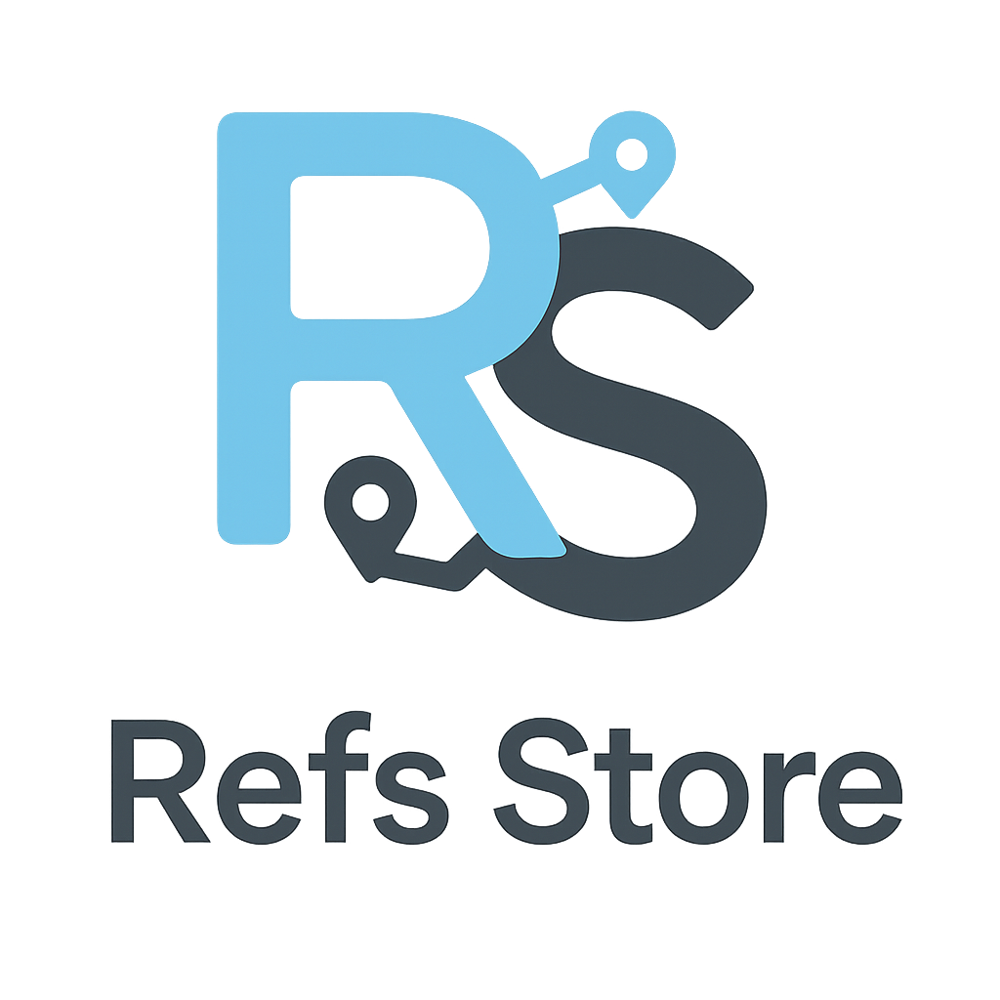

<div align="center">
  <br />
  
  <br />
  <br />
  
  <h1>React Ref Store</h1>
  
  <p>
    <strong>React에서 querySelector 대신 ref를 통해 DOM 요소를 관리하는 유틸리티</strong>
  </p>
  
  <p>
    <a href="https://www.npmjs.com/package/react-ref-store">
      
    </a>
    <a href="https://github.com/YOUR_USERNAME/react-ref-store/blob/main/LICENSE">
      
    </a>
    <a href="https://www.npmjs.com/package/react-ref-store">
      
    </a>
    
  </p>
</div>

<br />

## 📦 설치

```bash
npm install react-ref-store
# or
pnpm add react-ref-store
# or
yarn add react-ref-store
```

## 🤔 언제 사용하나요?

- 부모 컴포넌트가 자식 컴포넌트들의 DOM 요소에 접근해야 할 때
- querySelector를 사용하지 않고 React 친화적으로 DOM을 관리하고 싶을 때
- 예: 탭, 메뉴, 애니메이션 인디케이터 등

## 📖 API

### 1. `createRefsStore()`

Context와 Provider, Hook을 한 번에 생성하는 팩토리 함수입니다.

```tsx
const TabRefsStore = createRefsStore<HTMLButtonElement>();

// 반환값
{
  Provider,  // Context Provider 컴포넌트
  useStore,  // Store를 가져오는 Hook
}
```

### 2. `useRefsStore()`

ref들을 Map 자료구조로 관리하는 Store를 생성합니다. (Context 없이 단독 사용)

```tsx
function MyComponent() {
  const refsStore = useRefsStore<HTMLDivElement>();
  // Map API 사용: refsStore.get(), refsStore.has() 등
}
```

### 3. `useRegisterRef()`

DOM 요소의 ref를 Store에 등록하는 Hook입니다.

```tsx
const ref = useRegisterRef(refsStore, 'unique-key');
return <div ref={ref}>...</div>;
```

## 💡 사용 예시

### 기본 사용법

```